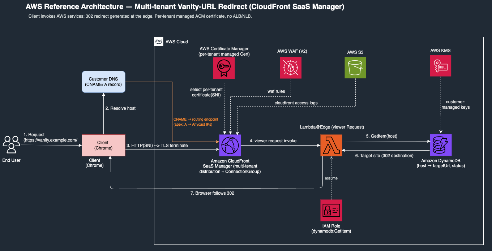
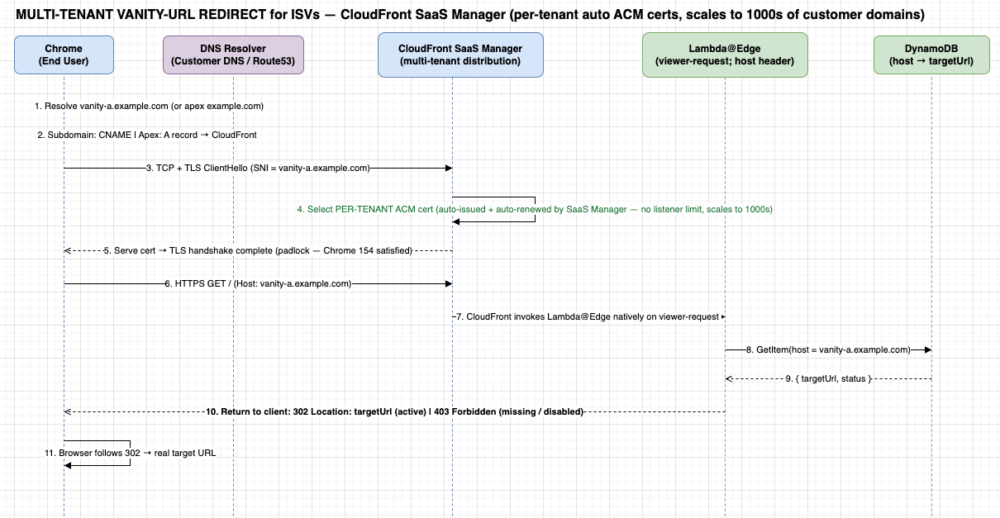

# Sample: Multi-tenant Vanity-URL Redirect with Amazon CloudFront SaaS Manager

> **⚠️ This is sample code, for non-production usage.** Before deploying, review it
> against your organization's security, regulatory, and compliance requirements —
> working with your security and legal teams where applicable.

For software companies (independent software vendors, or ISVs) that let each customer use their own branded
domain over HTTPS, and need this to work for many customers without managing a
certificate per customer by hand.

Sample AWS CDK (Python) code that builds a **multi-tenant vanity-URL redirect
service** on **Amazon CloudFront SaaS Manager**. It serves HTTP `302` redirects
for many **customer-owned custom domains** — each with its **own auto-issued,
auto-renewed ACM certificate** — from a **single** CloudFront multi-tenant
distribution, with redirect targets stored in **Amazon DynamoDB** and generated
at the edge by **Lambda@Edge**.

## Who this is for

This pattern fits any builder who needs to serve many custom domains from one
place — individual developers and students learning CloudFront SaaS Manager,
internal platform teams, non-profit, educational, or government projects, and
software businesses of any size. A common example is giving each customer a
branded domain — a subdomain such as `go.customer-a.com` or a root domain such
as `customer-c.net` — with a valid HTTPS padlock. Each domain becomes its
own **distribution tenant** with its **own certificate**, so onboarding a new
customer is a data change (one DNS record, one tenant, one DynamoDB row) rather
than a certificate ticket. Because certificates are issued and renewed per
tenant, one tenant's certificate problem does not affect the others, while the
distribution, edge function, and table are shared to keep costs down. This makes
the design straightforward to drive from a control plane and scale to thousands
of customers.

> **Why not an ALB?** A common first design terminates TLS on an Application
> Load Balancer, but an ALB listener holds at most **100 SSL certificates** (a
> hard limit), and customer-owned domains rule out wildcard certificates — so
> the design stops at about 100 customers. CloudFront SaaS Manager has **no
> per-account quota on SNI certificates** and a default of **10,000 distribution
> tenants per account**, which removes that ceiling and the manual certificate
> work.



*Sequence view:*



## Key concepts

New to CloudFront or DNS terminology? These are the terms used throughout this
sample:

| Term | What it means here |
|------|--------------------|
| **Vanity URL** | A customer's own branded domain (e.g. `go.customer-a.com`) that redirects to a target URL. |
| **Multi-tenant distribution** | One CloudFront distribution whose configuration is shared by many customers ("tenants"), instead of one distribution per customer. |
| **Distribution tenant** | A single customer's domain attached to the shared distribution, with its own certificate. |
| **ConnectionGroup / routing endpoint** | The CloudFront-provided hostname that a tenant subdomain points at with a DNS `CNAME`. |
| **Lambda@Edge** | A Lambda function CloudFront runs *at the edge* (close to the viewer) on each request — here it returns the `302` without ever contacting an origin server. |
| **ACM certificate** | An AWS Certificate Manager TLS certificate. In this sample each tenant gets one automatically issued and renewed. |
| **SNI** (Server Name Indication) | A TLS feature that lets many certificates share one endpoint by sending the requested hostname during the TLS handshake. |
| **CNAME** | A DNS record that points one hostname at another. Used for subdomains. |
| **A record** | A DNS record that points a hostname at IP addresses. Used for apex domains, which cannot use a `CNAME`. |
| **Apex / root domain** | A domain with no label prefix (e.g. `example.com` rather than `www.example.com`). |
| **Anycast static IP list** | A set of fixed CloudFront IP addresses, needed only for apex domains (quota-gated). |
| **TLS** | Transport Layer Security — the encryption behind HTTPS. |
| **HSTS** | HTTP Strict-Transport-Security — a response header telling browsers to always use HTTPS. |

## How it works

1. A user requests `https://vanity.example.com/`.
2. The customer's DNS points that hostname at CloudFront:
   - **Subdomain** → `CNAME` to the CloudFront **ConnectionGroup routing endpoint**.
   - **Apex/naked domain** → `A` record to a CloudFront **Anycast static IP list**.
3. CloudFront selects the **per-tenant managed ACM certificate** (SNI) and
   terminates TLS.
4. On the `viewer-request` event, **Lambda@Edge** reads the `Host` header, looks
   it up in **DynamoDB**, and returns a `302` with the stored `Location` (plus
   `Strict-Transport-Security`). Unknown/disabled hosts → `403`. The origin is
   never contacted.

Only three things are per-tenant — the **tenant**, its **managed certificate**,
and its **DynamoDB row**. The distribution, connection group, Lambda@Edge
function, and table are shared.

## Prerequisites

> **New to any of this?** These steps use the AWS CLI, CloudFront, and DNS. If a
> term is unfamiliar, every concept is defined in [Key concepts](#key-concepts)
> above, plus these starting points:
> [AWS CLI getting started](https://docs.aws.amazon.com/cli/latest/userguide/getting-started-quickstart.html),
> [CloudFront introduction](https://docs.aws.amazon.com/AmazonCloudFront/latest/DeveloperGuide/Introduction.html),
> and [DNS basics](https://docs.aws.amazon.com/Route53/latest/DeveloperGuide/welcome-dns-service.html).

- An AWS account and credentials configured for the AWS CLI.
- **AWS CDK v2** CLI (`npm install -g aws-cdk`) and **Python 3.12+**.
- **Node.js 20+** (required by the CDK CLI).
- A **domain you control** (required). Both stacks attach an ACM certificate that
  is **DNS-validated**, so deployment waits until you add the validation CNAME at
  your DNS provider. Pass it with `-c domain_name=<your-domain>`.
- Region is pinned to **us-east-1** (required for CloudFront certificates,
  Lambda@Edge, and SaaS Manager artifacts).

> **Cost:** this sample provisions billable resources — a KMS customer-managed key,
> an S3 access-logs bucket, a WAFv2 WebACL, CloudFront, Lambda@Edge, and DynamoDB.
> It is **not free-tier only**. Estimate with the [AWS Pricing Calculator](https://calculator.aws/),
> and run `cdk destroy` (then empty/remove the logs bucket) when you're done.

### Where you run this from (Windows / Mac / Linux / EC2 / CloudShell)

The steps are identical everywhere; only how you provide AWS credentials differs:

| Environment | Credentials |
|-------------|-------------|
| **Windows (PowerShell / WSL)** | `aws configure --profile <name>`, then `$Env:AWS_PROFILE="<name>"` (PowerShell) or `export AWS_PROFILE=<name>` (WSL / Git Bash) |
| **Mac / Linux / on-prem** | `aws configure --profile <name>`, then `export AWS_PROFILE=<name>` |
| **EC2** | Attach an **IAM instance role** — the CLI/CDK auto-detect it (no keys on disk) |
| **CloudShell / Cloud9** | Inherited automatically |

> **Windows note:** the helper script `scripts/seed_and_test.sh` is a bash script;
> run it under **WSL** or **Git Bash**, or run the equivalent `aws`/`curl`
> commands directly in PowerShell.

Always confirm the target account before deploying: `aws sts get-caller-identity`.

### Choose your domain type — CNAME (subdomain) vs A record (apex)

A tenant's domain is either a **subdomain** or an **apex (root) domain**. This
determines the DNS record you create and whether you need an extra AWS resource:

| | **Subdomain** — `vanity.example.com` | **Apex / root** — `example.com` |
|---|---|---|
| DNS record you add | `CNAME` → CloudFront routing endpoint | `A` record(s) → CloudFront **Anycast static IPs** |
| Why | Subdomains may hold a CNAME | Apex **cannot** hold a CNAME (DNS rule) → needs fixed IPs |
| Extra AWS resource | none | **Anycast static IP list** + connection-group binding |
| Extra prerequisite | none | **Service Quota `L-6A19EDFD` ≥ 1** (default is **0**) |
| Status in this sample | ✅ Fully coded & tested (primary path) | 📄 Documented (see [For apex domains](#for-apex-domains-root-domains)); Anycast code not included |

You can use **either or both** — the tenant/cert/DynamoDB steps are identical; only
the DNS record (and, for apex, the Anycast prerequisite) differ.

**If you plan to use an apex domain**, request the Anycast quota first (it can take
time / go through Support):

```bash
aws service-quotas request-service-quota-increase \
  --service-code cloudfront --region us-east-1 \
  --quota-code L-6A19EDFD --desired-value 2
```

## Quick Start

```bash
git clone <your-fork-url>
cd sample-aws-cloudfront-saas-manager-multi-tenant-vanity-url-redirect

python3 -m venv .venv && source .venv/bin/activate
pip install -r requirements.txt

cdk bootstrap aws://<ACCOUNT_ID>/us-east-1     # once per account
```

### Phase 1 — core redirect distribution (your domain + ACM certificate)

```bash
cdk deploy VanityRedirectCore -c domain_name=<your-domain>
# Deployment pauses while ACM validates the certificate: add the DNS-validation
# CNAME shown in the ACM console (or stack events) at your DNS provider.
# Once the cert issues and the stack completes, note the DistributionDomain output:
./scripts/seed_and_test.sh <DistributionDomain>
```

The distribution serves over your domain with an ACM certificate pinned to
**TLSv1.2_2021**, encrypts the redirect map with a **customer-managed KMS key**,
and writes **access logs** to a hardened S3 bucket. The smoke test injects an
`x-vanity-host` header on the CloudFront domain. Expected: active host → **302**
with `Location` + HSTS; disabled/unknown → **403**.

### Completing ACM certificate validation (the deploy pauses here)

Both stacks create a **DNS-validated** ACM certificate, so `cdk deploy` **pauses
partway through and waits for you** to prove domain ownership. This is expected —
the deploy is not stuck.

**What you'll see.** After the security-review prompt (answer `y`):

```
Stack includes security-sensitive updates and "--require-approval" is set to 'broadening'.
Do you wish to deploy these changes? (y/n) y
```

the progress bar stalls (around `(10/13)` for `VanityRedirectCore`) with the
certificate resource `CREATE_IN_PROGRESS`:

```
CREATE_IN_PROGRESS | AWS::CertificateManager::Certificate | ViewerCertificate
```

It stays here until the validation record is added and ACM verifies it. The
reported "Deployment time" includes this wait, so **budget up to ~1 hour** —
almost all of it idle, waiting on you plus ACM.

**Find the exact record to add.** The value is unique to your certificate — read
it from any one of these (all show the same record):

1. **Your `cdk deploy` terminal** — the certificate event prints it inline:
   ```
   Content of DNS Record is: {Name: _<token>.<your-domain>., Type: CNAME, Value: _<value>.<id>.acm-validations.aws.}
   ```
2. **ACM console** (region `us-east-1`) → the `<your-domain>` certificate in
   *Pending validation* → the **Domains** section shows the CNAME **name** and
   **value** (with Route 53 you get a one-click "Create records in Route 53"; for
   external DNS, copy the two values).
3. **CloudFormation console** → `VanityRedirectCore` stack → **Events** → the
   `ViewerCertificate` row's status reason contains the same `Content of DNS Record is: {…}`.
4. **CLI:**
   ```bash
   # Find the pending cert ARN, then read its validation record:
   aws acm list-certificates --region us-east-1 \
     --query "CertificateSummaryList[?Status=='PENDING_VALIDATION'].CertificateArn" --output text

   aws acm describe-certificate --region us-east-1 \
     --certificate-arn <cert-arn> \
     --query "Certificate.DomainValidationOptions[].ResourceRecord" --output table

   # …or read it straight from the stack events:
   aws cloudformation describe-stack-events --stack-name VanityRedirectCore --region us-east-1 \
     --query "StackEvents[?contains(to_string(ResourceStatusReason),'DNS Record')].ResourceStatusReason | [0]" \
     --output text
   ```

**Add the CNAME at your DNS provider, then verify it resolves:**

| Type | Name / Host | Value / Target |
|------|-------------|----------------|
| `CNAME` | `_<token>` (the validation label from above) | `_<value>.<id>.acm-validations.aws` |

```bash
dig +short CNAME _<token>.<your-domain>
# expect the _<value>.<id>.acm-validations.aws. target
```

Once it resolves, ACM validates (typically a few minutes, up to ~30) and the
deploy **continues on its own** — do not restart it (ACM allows up to 72 hours).

- The record is unique **per certificate and per account** — always read it from
  your own deploy; never copy one from elsewhere.
- Both phases create a certificate for the same domain. In the **same account**,
  ACM reuses the **same** validation record, so Phase 2's certificate usually
  validates **instantly** once Phase 1's record is in place.

### Phase 2 — a real custom domain with a per-tenant managed certificate

Because a `DistributionTenant` verifies domain ownership at create time, the
DNS record must resolve **before** the tenant is created. Deploy in two steps:

```bash
# (a) Infrastructure only: template distribution + connection group
cdk deploy VanityRedirectSaaS \
  -c enable_saas=true \
  -c domain_name=example.com \
  -c tenant_subdomains=vanity

# (b) In YOUR DNS, add the record for your domain type and verify it resolves.
#     Subdomain -> CNAME (primary path);  Apex -> A records to Anycast IPs.
#     See "Configure DNS records" below for the exact record tables + dig checks.

# (c) Create the tenant + managed certificate
cdk deploy VanityRedirectSaaS \
  -c enable_saas=true \
  -c domain_name=example.com \
  -c tenant_subdomains=vanity \
  -c create_tenant=true
```

> **Certificate note:** step (a) also creates a DNS-validated certificate
> (`TemplateCertificate`). It validates exactly like Phase 1 — see
> [Completing ACM certificate validation](#completing-acm-certificate-validation-the-deploy-pauses-here).
> For the same domain in the same account, ACM reuses the Phase 1 record, so it
> typically validates immediately.

Then seed a redirect and test the real domain:

```bash
aws dynamodb put-item --region us-east-1 --table-name vanity-redirect-sample --item '{
  "host":{"S":"vanity.example.com"},
  "targetUrl":{"S":"https://aws.amazon.com/"},
  "status":{"S":"active"}}'

curl -s -D - -o /dev/null https://vanity.example.com/          # expect 302 + Location + HSTS
curl -sL -o /dev/null -w '%{url_effective} %{http_code}\n' https://vanity.example.com/   # follows to target
```

### Add more tenants (multi-tenant demo)

Add another subdomain to the same distribution — its **own** managed cert, its
**own** target:

```bash
# 1) add DNS CNAME:  book -> <RoutingEndpoint>   (in your DNS)
# 2) redeploy with both subdomains
cdk deploy VanityRedirectSaaS -c enable_saas=true -c domain_name=example.com \
  -c tenant_subdomains=vanity,book -c create_tenant=true
# 3) seed its target
aws dynamodb put-item --region us-east-1 --table-name vanity-redirect-sample --item '{
  "host":{"S":"book.example.com"},"targetUrl":{"S":"https://www.booking.com/"},"status":{"S":"active"}}'
```

## Context flags

| Flag | Purpose | Default |
|------|---------|---------|
| `enable_saas=true` | Synthesize the Phase 2 SaaS stack | off |
| `domain_name=example.com` | Your registered domain | `example.com` |
| `tenant_subdomains=vanity,book` | Comma-separated subdomains, one tenant each | `vanity` |
| `create_tenant=true` | Create tenants (only after DNS resolves) | off |

## Configure DNS records

After deploying the infrastructure (Phase 2a), you point the tenant domain at
CloudFront. Do this in **your** DNS provider (registrar or Route 53). The record
type depends on your domain type.

### Subdomain (CNAME) — primary path

| Type | Name / Host | Value / Points to | TTL |
|------|-------------|-------------------|-----|
| `CNAME` | `vanity` | `<RoutingEndpoint output from Phase 2a>` | 600 (or default) |

Verify it resolves publicly **before** creating the tenant:

```bash
dig +short CNAME vanity.example.com
# expect: <RoutingEndpoint>.   e.g. dxxxxxxxx.cloudfront.net.
# no dig? open: https://dns.google/resolve?name=vanity.example.com&type=CNAME
```

### Apex / root domain (A record) — <a name="for-apex-domains-root-domains"></a>reference

> Apex domains (`example.com`, no label prefix) **cannot** hold a CNAME, so they
> use `A` records pointing at a CloudFront **Anycast static IP list**. This path
> is **documented but not shipped as runnable code** in this sample, because the
> Anycast IP list quota (`L-6A19EDFD`) defaults to **0** and must be raised first
> (see Prerequisites). The tenant/cert/DynamoDB steps are otherwise identical.

Steps once the Anycast quota is granted:

1. Create a **CloudFront Anycast static IP list** and attach it to the connection
   group (`anycast_ip_list_id`). This yields ~3 fixed IP addresses.
2. In your DNS, add one `A` record per Anycast IP at the **apex** (`Host = @`):

   | Type | Name / Host | Value | TTL |
   |------|-------------|-------|-----|
   | `A` | `@` | `<Anycast IP 1>` | 600 |
   | `A` | `@` | `<Anycast IP 2>` | 600 |
   | `A` | `@` | `<Anycast IP 3>` | 600 |

3. Verify the apex resolves to those IPs, then create the tenant with
   `domains=["example.com"]` (same `create_tenant=true` step as the subdomain).

```bash
dig +short A example.com          # expect the Anycast IPs
```

The Anycast IP list **replaces the static-IP load-balancer tier** (e.g. an NLB)
that would otherwise be needed to give apex domains fixed IPs.

## Project Structure

```
.
├── app.py                       # CDK app entry (Phase 1 always; Phase 2 gated by -c enable_saas)
├── cdk.json
├── requirements.txt
├── pyproject.toml               # ruff lint config
├── stacks/
│   ├── core_stack.py            # Phase 1: DynamoDB + Lambda@Edge + CloudFront distribution
│   └── saas_stack.py            # Phase 2: template distribution + connection group + tenants
├── lambda/
│   └── redirect_edge/handler.py # viewer-request handler: Host -> DynamoDB -> 302/403 + HSTS
├── scripts/
│   └── seed_and_test.sh
├── docs/
│   └── architecture-sequence.png
└── .github/workflows/ci.yml     # ruff lint + cdk synth + gitleaks secret scan
```

## Key service quotas (grounded)

From the [CloudFront Developer Guide quotas](https://docs.aws.amazon.com/AmazonCloudFront/latest/DeveloperGuide/cloudfront-limits.html):

- **Distribution tenants per account:** 10,000 (default, adjustable).
- **Multi-tenant distributions per account:** 20 (adjustable).
- **SSL certificates when serving via SNI:** *no account quota*.
- **Anycast static IP lists per account:** 0 by default (request increase for apex).

## FAQ / Troubleshooting

**The deploy looks stuck around `(10/13)` — is it broken?**
No. That's the ACM certificate step waiting for DNS validation. Add the
validation CNAME and the deploy resumes automatically — see
[Completing ACM certificate validation](#completing-acm-certificate-validation-the-deploy-pauses-here).

**Creating the tenant fails with `AlreadyExists … One or more of the CNAMEs you provided are already associated with a different resource`.**
CloudFront alternate/tenant domains are **globally unique across all AWS
accounts**. Your tenant FQDN (e.g. `vanity.<your-domain>`) is already attached to
another CloudFront distribution or tenant — possibly in a different account.
Either use a different subdomain (e.g. `-c tenant_subdomains=<other>`), or release
the existing claim. To locate a claim in an account you control:

```bash
aws cloudfront list-distribution-tenants --region us-east-1 \
  --query "DistributionTenantList[].{Name:Name,Domain:Domains[0].Domain,Status:Status}" --output table
```

**Creating the tenant fails with `Could not verify Domain Name ownership. It may not be pointing to a valid CloudFront resource`.**
The tenant's DNS record wasn't resolving when you ran `-c create_tenant=true`. A
`DistributionTenant` verifies ownership at create time, so the CNAME must resolve
**first**. Add the subdomain CNAME → the `RoutingEndpoint` from step (a), confirm
it, then re-run step (c):

```bash
dig +short CNAME <subdomain>.<your-domain>    # must return the RoutingEndpoint
```

**How do I confirm the redirect is actually generated at the edge?**
A successful response is `HTTP 302` with a `Location` header,
`Strict-Transport-Security`, and `X-Cache: LambdaGeneratedResponse from cloudfront`
— the edge function produced the response and the origin is never contacted.

**`cdk destroy` fails on the Lambda@Edge function or a non-empty S3 log bucket.**
Lambda@Edge keeps replicas for a few hours after the distribution is removed, so
destroy may report `DELETE_FAILED` on the edge-function version — wait a few hours
and retry, or delete the stack retaining that resource. The access-logs bucket is
versioned and self-logging; delete all object versions (disable its bucket logging
first so it stops re-filling) before it can be removed.

**Node version warning (`This software has not been tested with node vXX`).**
Harmless. Silence it with `export JSII_SILENCE_WARNING_UNTESTED_NODE_VERSION=1`.

## Cleanup

```bash
cdk destroy VanityRedirectSaaS VanityRedirectCore
# remove the DNS records you added in your DNS provider
```

## Security

See [SECURITY.md](SECURITY.md). Highlights: open-redirect protection (absolute
http(s) targets + `status=active`; add a per-tenant destination allowlist for
production), HSTS on responses, least-privilege IAM (`dynamodb:GetItem` only),
and no stored secrets.

## Documentation

- [docs/ARCHITECTURE.md](docs/ARCHITECTURE.md) — design, components, request flow, subdomain vs apex, cost shape.
- [CHANGELOG.md](CHANGELOG.md) — release notes.

## References

- [Amazon CloudFront SaaS Manager / multi-tenant distributions](https://docs.aws.amazon.com/AmazonCloudFront/latest/DeveloperGuide/distribution-multi-tenant.html)
- [CloudFront quotas](https://docs.aws.amazon.com/AmazonCloudFront/latest/DeveloperGuide/cloudfront-limits.html)
- [Lambda@Edge](https://docs.aws.amazon.com/AmazonCloudFront/latest/DeveloperGuide/lambda-at-the-edge.html)

## License

This library is licensed under the MIT-0 License. See the [LICENSE](LICENSE) file.
